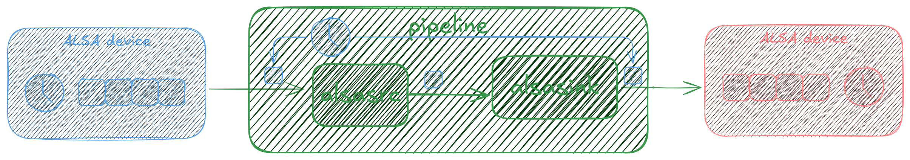

## Me 

* GStreamer, PipeWire, PulseAudio person
* Founder @ [asymptotic](https://asymptotic.io)
  - Help build cool things with these projects
  - Contribute back to upstream better
  - ???
  - Positive feedback loop

---

## Clocks

::::: {.columns}
::: {.column width=70%}
* Devices derive time from a clock
* A repeating signal with a fixed frequency
* Generated by a quartz crystal
:::
::: {.column width=30%}

:::
:::::

---

## Time is an illusion

* Different devices will have different crystals
* With _slightly different_ notions of time

{ width=70% }

---

## The rate matching problem { data-auto-animate=true }

{ width=70% }

* Two devices with different clocks 
* Producing data every "1ms", say

---

## The rate matching problem { data-auto-animate=true }

{ width=70% }

* What happens if the source is _slower_ than sink
* Or if the source is _faster_ than the sink?

---

## The rate matching problem { data-auto-animate=true }

{ width=70% }

* Source slower than sink: _Underflow!_
* Sink slower than source: _Overflow!_

---

## GStreamer

---

## GStreamer: Clocks { data-auto-animate=true }

* Clocks are represented via `GstClock`
* Report the current time
* Wait until a certain time

---

## GStreamer: Clocks { data-auto-animate=true }

* One for the `pipeline`
* Elements synchronise to this
* i.e. decide when to render data

---

## GStreamer: Clocks { data-auto-animate=true }

* Elements can provide their own clocks
* System clock
* Audio clocks
* NTP, PTP, netclock

---

## GStreamer: Clocks { data-auto-animate=true }

* Pair to system clock for continuous output
* Linear regression
  - $t^1_{audio} \implies t^1_{sys}$
  - $t^2_{audio} \implies t^2_{sys}$
  - $\therefore t^{now}_{sys} \implies t^{now}_{audio}$
* With some heuristic filtering

---

## GStreamer: Clocks { data-auto-animate=true }

{ width=90% }

---

## GStreamer: Clocks { data-auto-animate=true }

{ width=90% }

---

## GStreamer: Rate matching { data-auto-animate=true data-auto-animate-restart=true }

* Only some elements sync to clock
* `GstAudioBaseSink`
* `GstAudioBaseSrc`
* `GstAudioAggregator`

---

## GStreamer: Rate matching { data-auto-animate=true }

They may...

1. Skew
2. Resample
3. Custom

---

## GStreamer: Rate matching { data-auto-animate=true }

* Skewing is most common
* "Spread" out the error
* Less audible glitches

---

## GStreamer: Rate matching { data-auto-animate=true }

* Sink faster than source
* Insert smaller gaps instead of underflowing

{ width=60% }

---

## GStreamer: Rate matching { data-auto-animate=true }

* Sink slower than source
* Overwrite smaller chunks instead of overflowing

{ width=58% }

---

## GStreamer: Rate matching { data-auto-animate=true data-background-image=dragons.png }

* Resampling
* *Magical* mathematics

---

## GStreamer: Rate matching { data-auto-animate=true }

* Produce the correct number of samples
* Implemented as linear interpolation
* Naïve and low quality
* Limitations of `GstAudioRingBuffer`

---

## GStreamer: Rate matching { data-auto-animate=true }

* Custom
* Let the application do _something_
* Like adjust the audio clock itself
  - "Pull" a PLL

---

## PipeWire

---

## PipeWire: Model

* Also a graph
* `process()` cycle
* Quantum-sized buffers
* Much like JACK

{ width=70% }

---

## PipeWire: Drivers { data-auto-animate=true }

* One _driver_ per graph
* All other nodes are _followers_
* Provides tick-per-quantum
* May or may not participate in data flow

---

## PipeWire: Drivers { data-auto-animate=true }

* System clock
* PTP
* Devices

---

## Detour: Control systems

{ width=90% }

---

## PipeWire: Delay-locked loops { data-auto-animate=true }

{ width=90% }

---

## PipeWire: Delay-locked loops { data-auto-animate=true }

* For each cycle, we have:
* `nsec`: Current cycle start time
* `next_nsec`: Expected next cycle start time
* *The relative rate of the driver and device clock*

---

## PipeWire: Rate matching { data-auto-animate=true }

{ width=90% }

---

## PipeWire: Rate matching { data-auto-animate=true }

* Can adapt to arbitrary clocks
* Can also adapt across graphs & mismatched quanta
* Resampler does fine-grained adjustment
* Converges quickly, hovers in a tight range
* Can use other mechanisms too

---

## PipeWire: Rate matching references

* Heavily inspired by JACK
* Bunch of work by Fons Adriaensen
  - [Using a DLL to filter time](https://kokkinizita.linuxaudio.org/papers/usingdll.pdf)
  - [Controlling adaptive resampling](http://kokkinizita.linuxaudio.org/papers/adapt-resamp.pdf)

---

## Observations { data-auto-animate=true }

* System clock as a source for continuous time
* Open-ish (linear regression + heuristics) vs. closed control loops
  - Audio clocks work well
  - Network clock jitter can be problematic

---

## Observations { data-auto-animate=true }

* You can skip `GstAudioRingBuffer`, like
  - Decklink elements
  - `pipewireaudiosink`
  - `pulsedirectsink`

---

## Questions? { data-background-image=bg.png data-background-size=contain }

### ♥

---

## Bonus slide

{ width=60% }
