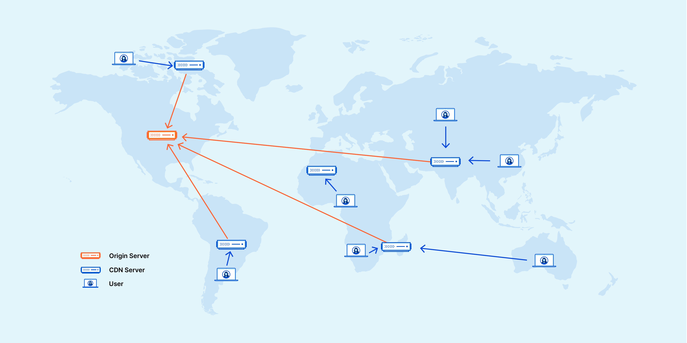
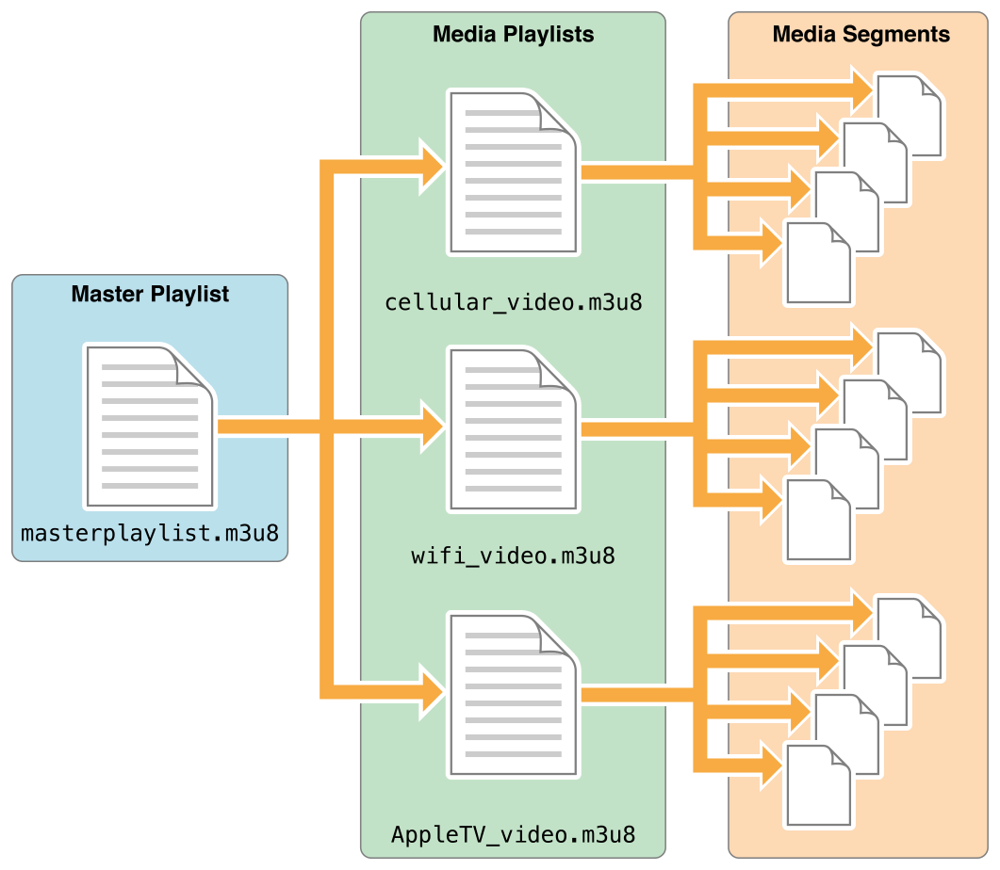

---
title:
- HLS master playlist management made easy
author:
- Sanchayan Maity
theme:
- default
classoption:
- aspectratio=169
---

# Who

- Open source consulting firm based out of Bangalore and Toronto.
- Building high-quality, low-level systems software.
- Providing services for audio/video using GStreamer and PipeWire.

# Agenda

- What's HTTP Live Streaming (HLS)
- HLS media and multi-variant playlist examples
- Multi-variant playlist helper bin implementation
- Future work

# HLS

- Developed by Apple and released in 2009
- Standardised in [RFC 8216](https://datatracker.ietf.org/doc/html/rfc8216)
- HTTP-based adaptive bit-rate streaming communications protocol
- HTTP traffic, unlike UDP-based protocols such as RTP
- Delivered over widely available HTTP-based content delivery networks

# Content Delivery Networks[^1]

{height=90%, width=90%}

[^1]: [What's a CDN?](https://www.cloudflare.com/learning/cdn/what-is-a-cdn/)

# HLS Architecture[^2]

{height=90%, width=90%}

[^2]: [HTTP Live Streaming](https://www.100ms.live/blog/hls-streaming)

# Media playlist[^3]

```m3u8
   #EXTM3U
   #EXT-X-TARGETDURATION:10
   #EXT-X-VERSION:3
   #EXTINF:9.009,
   http://media.example.com/first.ts
   #EXTINF:9.009,
   http://media.example.com/second.ts
   #EXTINF:3.003,
   http://media.example.com/third.ts
   #EXT-X-ENDLIST
```

[^3]: [RFC 8216](https://datatracker.ietf.org/doc/html/rfc8216#page-50)

# Master/Multivariant playlist[^4]


{height=85%}

[^4]: [About HTTP Live Streaming](https://developer.apple.com/library/archive/referencelibrary/GettingStarted/AboutHTTPLiveStreaming/about/about.html)

# Multivariant playlist[^5]

```m3u8
   #EXTM3U
   #EXT-X-STREAM-INF:BANDWIDTH=1280000,AVERAGE-BANDWIDTH=1000000
   http://example.com/low.m3u8
   #EXT-X-STREAM-INF:BANDWIDTH=2560000,AVERAGE-BANDWIDTH=2000000
   http://example.com/mid.m3u8
   #EXT-X-STREAM-INF:BANDWIDTH=7680000,AVERAGE-BANDWIDTH=6000000
   http://example.com/hi.m3u8
   #EXT-X-STREAM-INF:BANDWIDTH=65000,CODECS="mp4a.40.5"
   http://example.com/audio-only.m3u8
```
[^5]: [RFC 8216](https://datatracker.ietf.org/doc/html/rfc8216#section-8.4)

# Multivariant playlist - I[^6]

```m3u8
   #EXTM3U
   #EXT-X-STREAM-INF:BANDWIDTH=1280000,CODECS="...",AUDIO="aac"
   low/video-only.m3u8
   #EXT-X-STREAM-INF:BANDWIDTH=2560000,CODECS="...",AUDIO="aac"
   mid/video-only.m3u8
   #EXT-X-STREAM-INF:BANDWIDTH=7680000,CODECS="...",AUDIO="aac"
   hi/video-only.m3u8
   #EXT-X-STREAM-INF:BANDWIDTH=65000,CODECS="mp4a.40.5",AUDIO="aac"
   main/english-audio.m3u8
```
[^6]: [RFC 8216](https://datatracker.ietf.org/doc/html/rfc8216#section-8.6)


# Multivariant playlist - II

```m3u8
   #EXT-X-MEDIA:TYPE=AUDIO,GROUP-ID="aac",NAME="English", \
      DEFAULT=YES,AUTOSELECT=YES,LANGUAGE="en", \
      URI="main/english-audio.m3u8"
   #EXT-X-MEDIA:TYPE=AUDIO,GROUP-ID="aac",NAME="Deutsch", \
      DEFAULT=NO,AUTOSELECT=YES,LANGUAGE="de", \
      URI="main/german-audio.m3u8"
```

# CODECS[^7]

- Stream
  - AAC low complexity (AAC-LC) audio
  - H.264 Main Profile Level 3.0 video
  - Codec string: `mp4a.40.2,avc1.4d401e`

[^7]: [RFC 8216](https://datatracker.ietf.org/doc/html/rfc8216#section-8.6)

# HLS playback

```bash
adaptivedemux2:  hlsdemux2: HLS Demuxer
hls:  hlsdemux: HLS Demuxer
libav:  avmux_hls: libav Apple HTTP Live Streaming muxer
typefindfunctions: application/x-hls: m3u8
```

# Playback pipeline

```bash
gst-play-1.0 https://devstreaming-cdn.apple.com/videos/streaming/examples/\n
img_bipbop_adv_example_ts/master.m3u8
```

# Playback pipeline graph


# HLS playlist generation

```bash
hls:  hlssink: HTTP Live Streaming sink
hls:  hlssink2: HTTP Live Streaming sink
hlssink3:  hlssink3: HTTP Live Streaming sink
hlssink3: hlscmafsink: HTTP Live Streaming CMAF sink
aws: awss3hlssink: Streams HLS data to S3
```


# `hlsmultivariantsink`

```{.d2}
direction: right
hlsmultivariantsink: {
  video_128000: {
    Variant: {
      Variant: |md
        - i-frame
        - uri
        - bandwidth
        - audio
        - video
        - codecs
      |
    }
  }
  video_256000: {
    Variant
  }
  audio: {
    AlternateRendition: {
      AlternateRendition: |md
        - uri
        - group_id
      |
    }
  }
  video_128000 -> hlssink3-low
  video_256000 -> hlssink3-mid
  audio -> hlssink3-audio
}
```

#  `hlsmultivariantsink`

```bash
  SINK template: 'video_%u'
    Availability: On request
    Capabilities:
      ANY
    Type: HlsMultivariantSinkPad
    Pad Properties:

      alternate-rendition : Alternate Rendition
                            flags: readable, writable, changeable only in
                            NULL or READY state
                            Boxed pointer of type "GstStructure"

      variant             : Variant Stream
                            flags: readable, writable, changeable only in
                            NULL or READY state
                            Boxed pointer of type "GstStructure"

```

# Implementation

- New GStreamer helper `bin` `hlsmultivariantsink`
- Alternate renditions & Variant streams specified via pad properties
- Generates codec string
  - For `CMAF`, uses `codec_utils_caps_get_mime_codec` helper and `codec_data`
  - For `MPEG-TS`, parses SPS/PPS from buffers with `gst::BufferFlags::HEADER` set
- In Rust, uses [m3u8-rs](https://docs.rs/m3u8-rs/latest/m3u8_rs/), [cros-codecs](https://github.com/chromeos/cros-codecs) and `hlscmafsink`/`hlssink3`
- Open MR: [!1515](https://gitlab.freedesktop.org/gstreamer/gst-plugins-rs/-/merge_requests/1515)

# Future work

- Support for
  - Closed Captions
  - WebVTT
    - Open MR: [hlswebvttsink: !982](https://gitlab.freedesktop.org/gstreamer/gstreamer/-/merge_requests/982)
- Helper bin on top of `hlsmultivariantsink`
  - Generate bit-rate ladder for variant streams
- LL-HLS

# Questions

- Reach out on
  * email:

        - hello@asymptotic.io
        - sanchayan@asymptotic.io
  * Mastodon: [sanchayanmaity.com](https://sanchayanmaity.com/@sanchayan)
  * Blog: [sanchayanmaity.net](https://sanchayanmaity.net/)
