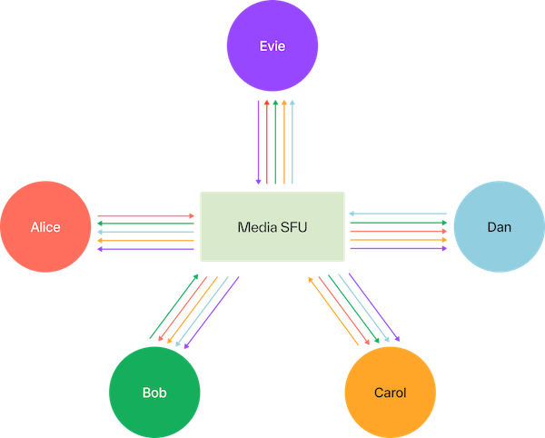
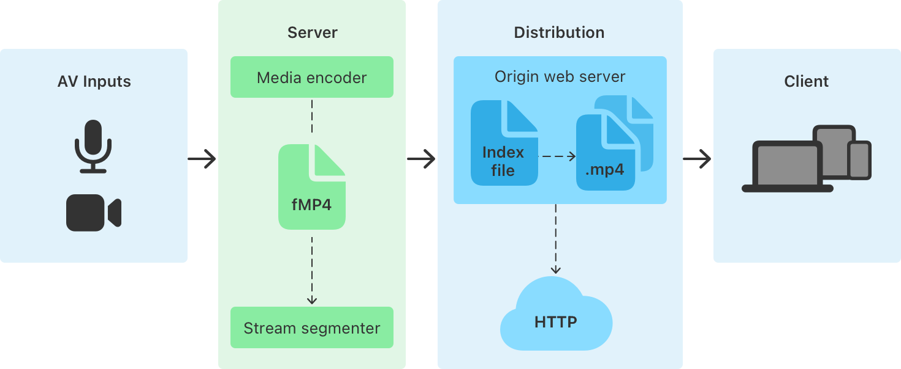

---
title:
- State of QUIC in GStreamer
author:
- Sanchayan Maity
theme:
- default
classoption:
- aspectratio=169
---

# Who

- Open source consulting firm based out of Bangalore and Toronto.
- Building high-quality, low-level systems software.
- Providing services for audio/video using GStreamer and PipeWire.

# Agenda

- Introduction to QUIC
- QUIC elements
    - review of the current state
    - challenges
- Overview of media related protocols
  - RTP over QUIC (RoQ)
  - Media over QUIC (MoQ)
- Potential future work

# QUIC

- Pronounced exactly like the English word "quick"
- Not an acronym
- Standardized in [RFC 9000](https://www.rfc-editor.org/rfc/rfc9000.html)
- Supported by
    - [RFC 8999 - Version independent properties of QUIC](https://www.rfc-editor.org/rfc/rfc8999.html)
    - [RFC 9001 - Using TLS to secure QUIC](https://www.rfc-editor.org/rfc/rfc9001.html)
    - [RFC 9002 - QUIC loss detection & congestion control](https://www.rfc-editor.org/rfc/rfc9002.html)

# HTTP/1.1

```{.d2}
direction: right
"HTTP/1.1" <-> Server: Asset 1
"HTTP/1.1" <-> Server: Asset 2
"HTTP/1.1" <-> Server: Asset 3
```

# HTTP/2

```{.d2}
direction: right
"HTTP/2" <-> B
B: 1 TCP Connection {
  Asset 1
  Asset 2
  Asset 3
}
B <-> Server
```

# HTTP + TCP + TLS[^1]

```{.d2 height=88%}
shape: sequence_diagram
Client -> Server: TCP SYN {
    style: {
        bold: true
    }
}
Server -> Client: TCP SYN + ACK {
    style: {
        bold: true
    }
}
Client -> Server: TCP ACK {
    style: {
        bold: true
    }
}
Client -> Server: TLS ClientHello {
    style: {
        bold: true
    }
}
Server -> Client: TLS ServerHello {
    style: {
        bold: true
    }
}
Client -> Server: TLS Finished {
    style: {
        bold: true
    }
}
Client -> Server: HTTP Request {
    style: {
        bold: true
    }
}
Server -> Client: HTTP Response {
    style: {
        bold: true
    }
}
```

[^1]: [Cloudflare: The road to QUIC](https://blog.cloudflare.com/the-road-to-quic/)


# Stack[^2]

{height=60%, width=60%}

[^2]: [HTTP/3 - Wikipedia](https://en.wikipedia.org/wiki/QUIC)


# QUIC

- Implemented on top of UDP
- Multiplexed over a single UDP port
- Fully encrypted
- Logical streams similar to HTTP/2
  - In-order and Reliable
  - Different streams can be out-of-order
  - Independent/no head of line blocking
- Unreliable datagrams
- Connection migration
- [RFC 7301 - TLS/Application-Layer Protocol Negotiation Extension](https://datatracker.ietf.org/doc/html/rfc7301)

# HTTP + QUIC[^3]

```{.d2 height=88%}
shape: sequence_diagram
Client -> Server: QUIC {
    style: {
        bold: true
    }
}
Server -> Client: QUIC {
    style: {
        bold: true
    }
}
Client -> Server: QUIC {
    style: {
        bold: true
    }
}
Client -> Server: HTTP Request {
    style: {
        bold: true
    }
}
Server -> Client: HTTP Response {
    style: {
        bold: true
    }
}
```

[^3]: [Cloudflare: The road to QUIC](https://blog.cloudflare.com/the-road-to-quic/)


# HTTP/3

```{.d2}
direction: right
"HTTP/3" <-> Server: Asset 1/Stream 1
"HTTP/3" <-> Server: Asset 2/Stream 2
"HTTP/3" <-> Server: Asset 3/Stream 3
```

# QUIC

- Limits based Flow control scheme[^4]
    - Stream level
    - Connection level
- Congestion control for both streams & datagrams
    - Bottleneck Bandwidth and Round-trip propagation (BBR)
    - Cubic [RFC 8312](https://www.rfc-editor.org/rfc/rfc8312)
    - Reno
    - [SCReAM](https://github.com/mengelbart/rtp-over-quic-mininet)

[^4]: [RFC 9000 - Flow Control](https://www.rfc-editor.org/rfc/rfc9000.html#name-flow-control)

# Implementations

- QUIC
    - [quinn-rs](https://github.com/quinn-rs/quinn)
    - [quiche](https://github.com/cloudflare/quiche)
    - [s2n-quic](https://github.com/aws/s2n-quic)
    - [neqo](https://github.com/mozilla/neqo)
    - [quic](https://github.com/kazu-yamamoto/quic)
    - [msquic](https://github.com/microsoft/msquic)
    - [ngtcp2](https://github.com/ngtcp2/ngtcp2)
    - [net: implement the QUIC protocol in linux kernel](https://lore.kernel.org/netdev/cover.1725935420.git.lucien.xin@gmail.com/)
- Prior work by British Broadcasting Corporation
    - [gst-quic-transport](https://github.com/bbc/gst-quic-transport)
    - [gst-roq](https://github.com/bbc/gst-roq)
    - Uses [ngtcp2](https://github.com/ngtcp2/ngtcp2)


# GStreamer

- New elements in `gst-plugins-rs`
  - `quinnquicsink` and `quinnquicsrc`
  - `quinnquicmux` and `quinnquicdemux` for stream multiplexing
  - `quinnroqmux` and `quinnroqdemux` for RTP over QUIC
  - Uses [quinn-rs](https://github.com/quinn-rs/quinn)
- Related merge requests
    - [!1634 - Stream multiplexing](https://gitlab.freedesktop.org/gstreamer/gst-plugins-rs/-/merge_requests/1634)
    - [!1775 - RTP over QUIC](https://gitlab.freedesktop.org/gstreamer/gst-plugins-rs/-/merge_requests/1775)


# Stream multiplexing

```{.d2}
direction: right
Stream1  -> quinnquicmux: Pad
Stream2  -> quinnquicmux: Pad
Stream3  -> quinnquicmux: Pad
Datagram -> quinnquicmux: Pad
quinnquicmux -> quinnquicsink: Query/Event
```

# Stream de-multiplexing


```{.d2}
direction: right
quinnquicsrc -> quinnquicdemux: Buffer Meta/Event
quinnquicdemux -> Stream1: Pad
quinnquicdemux -> Stream2: Pad
quinnquicdemux -> Stream3: Pad
quinnquicdemux -> Datagram: Pad
```

# RoQ[^5]

```{.d2}

direction: down
QUIC Datagram: QUIC Datagram {
    near: center-left
    shape: rectangle
    style.border-radius: 8
    Flow ID: Flow ID
    RTP Packet: RTP Packet
}
One STREAM per RTP Packet {
    direction: down
    shape: rectangle
    style.border-radius: 8
    Payload: "" {
        shape: rectangle
        style.border-radius: 8
        Flow ID: Flow ID
        Packet 1: "" {
            Length
            RTP Packet: RTP Packet
        }
    }
}
One STREAM per Flow Identifier {
    near: center-right
    shape: rectangle
    style.border-radius: 8
    Payload: "" {
        shape: rectangle
        style.border-radius: 8
        Flow ID: Flow ID
        Packet 1: "" {
            Length
            RTP Packet: RTP Packet
        }
        Packet 2: "" {
            Length
            RTP Packet: RTP Packet
        }
    }
}
```

[^5]: [RFC draft - RTP over QUIC](https://datatracker.ietf.org/doc/draft-ietf-avtcore-rtp-over-quic/)

# RoQ multiplexing

```{.d2 height=90%}
direction: right
Stream1   -> quinnroqmux: Flow Id 1
Stream2   -> quinnroqmux: Flow Id 2
Datagram1 -> quinnroqmux: Flow Id 3
Datagram2 -> quinnroqmux: Flow Id 4
quinnroqmux -> quinnquicsink: Buffer Meta/Query/Event
```

# RoQ de-multiplexing

```{.d2}
direction: right
quinnquicsrc -> quinnroqdemux: Buffer Meta/Event
quinnroqdemux -> Stream1: Flow Id 1
quinnroqdemux -> Stream2: Flow Id 2
quinnroqdemux -> Datagram1: Flow Id 3
quinnroqdemux -> Datagram2: Flow Id 4
```

# WebRTC[^6]

{height=60%, width=60%}

[^6]: [quic.video - Replacing WebRTC](https://quic.video/blog/replacing-webrtc/)

# HTTP Live Streaming (HLS)[^7]


{height=90%, width=90%}

[^7]: [HTTP Live Streaming](https://developer.apple.com/documentation/http-live-streaming)

# WebRTC vs HLS[^8]

- Scale vs Latency
- WebRTC
    - Optimized for playback at the live-edge only
    - Difficult to use for near-live and VOD playback
- HLS
    - Can operate at scale in the one-to-few-seconds latency range
    - Not for real-time

[^8]: [quic.video - Replacing WebRTC](https://quic.video/blog/replacing-webrtc/)

# Bridging WebRTC & HLS

```{.d2}
direction: right
WebRTC <-> SFU
SFU -> GStreamer: Track
SFU -> GStreamer: Track
SFU -> GStreamer: Track
GStreamer -> RTMP
GStreamer -> AWS S3
RTMP -> Wowza
AWS S3 -> AWS MediaLive
```

# Media over QUIC[^9]

- **Simple low-latency media delivery solution for ingest and distribution of media**
- Application-level multicast overlay/application layer Named Data Networking
- Designed considering all three latency regimes: real-time, interactive, and VOD

[^9]: [What's the deal with Media over QUIC](https://www.ietf.org/blog/moq-overview/)

# MoQ topology - Example I[^10]


```{.d2 height=88%}
direction: right
Publisher -> Relay
Relay -> Subscriber 1
Relay -> Subscriber 2
Relay -> Subscriber n
```

[^10]: [Getting Media Over QUIC (MoQ) and WebRTC to like each other](https://www.meetecho.com/blog/moq-webrtc/)

# MoQ topology - Example II[^11]

```{.d2 height=88%}
direction: right
Publisher -> Relay
Relay -> Relay 1
Relay -> Relay 2
Relay -> Relay 3
Relay 1 -> Subscriber 1
Relay 2 -> Subscriber 2
Relay 2 -> Subscriber 3
Relay 3 -> Subscriber 4
```

[^11]: [Getting Media Over QUIC (MoQ) and WebRTC to like each other](https://www.meetecho.com/blog/moq-webrtc/)

# MoQ implementations[^12]

- [moq-rs](https://github.com/kixelated/moq-rs)
- [moxygen](https://github.com/facebookexperimental/moxygen)
- [moqtransport](https://github.com/mengelbart/moqtransport)

[^12]: [MoQ RFCs](https://datatracker.ietf.org/group/moq/documents/)

# QUIC toolbox

```{.d2}
direction: right
QUIC toolbox: "" {
  Multiplexing: "" {
    QUIC mux
    RoQ mux
    MoQ mux
  }
  Transport Sink: "" {
    QUIC sink
    WebTransport sink
  }
  Multiplexing -> Transport Sink
  De-multiplexing: "" {
    QUIC demux
    RoQ demux
    MoQ demux
  }
  Transport Source: "" {
    QUIC source
    WebTransport source
  }
  De-multiplexing <- Transport Source
}
```

# Future work

- Support for WebTransport
- Handling flow and congestion control
- Improvements to RTP over QUIC (stream per GOP and RTCP)
- Media over QUIC elements - Publisher & Subscriber
- Interoperability between `gst-quic-transport`, `gst-roq`, `moq-rs` & `moxygen`
- Re-usability of queries, metas and events with other implementations

# Questions

- Reach out on
  * email:

        - hello@asymptotic.io
        - sanchayan@asymptotic.io
  * Mastodon: [sanchayanmaity.com](https://sanchayanmaity.com/@sanchayan)
  * Blog: [sanchayanmaity.net](https://sanchayanmaity.net/)
