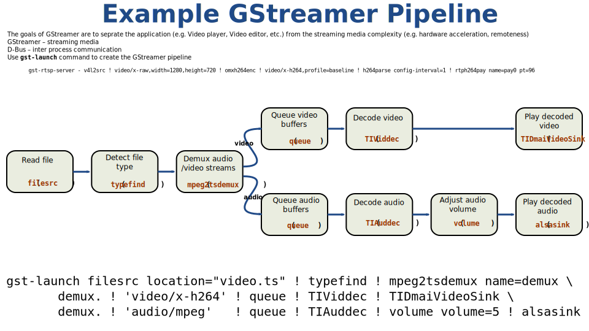

# What is PulseAudio?

- Network capable sound server program
- Initial release on 17 July 2004
- First appeared for users in Fedora Linux with version 8

# Bluetooth Profiles

- What is a profile?
- Some of the widely used bluetooth profiles
	* Advanced Audio Distribution Profile (A2DP)
	* Audio/Video Remote Control Profile (AVRCP)
	* Hands-Free Profile (HFP)
	* Headset Profile (HSP)

# Bluetooth Codecs

- Available codecs?
	- Low-complexity subband codec (SBC)
	- Audio Processing Technology (aptX, aptX-HD)
	- Advanced Audio Coding (AAC)
	- LDAC
- So which is better?

# Current State

- Upstream only supports SBC :(
- HSP/HFP support via ofono
- Out of tree community effort with https://github.com/EHfive/pulseaudio-modules-bt
- In progress work by Pali Rohár

# Challenges

- Profile and codec switching
- Patent encumbered licenses?
- How to support multiple encoders or decoders?

# GStreamer

* What is GStreamer?
* Why?

# Example Pipeline

# Progress so far

- LDAC support upstreamed in GStreamer
- Support for Low-Overhead MPEG-4 Audio Transport Multiplex (LATM) AAC in GStreamer
- GStreamer wrapper around Pali Rohár's *libopenaptx*
- Implementing profile and codec switching
- Proof of concept with GStreamer tested

# Conclusion

##### What's next?
