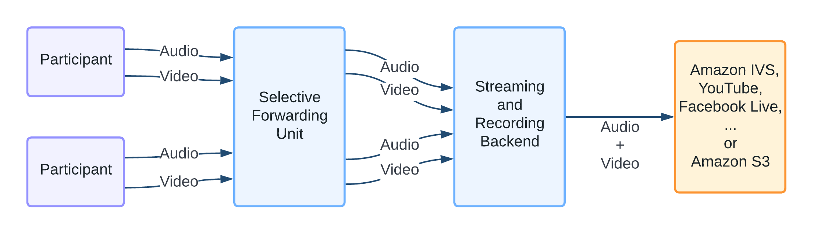
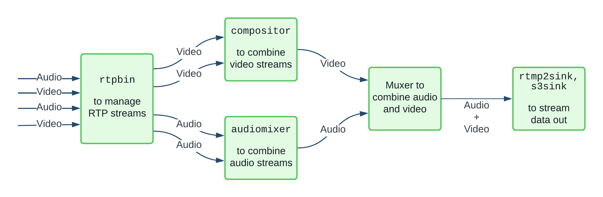
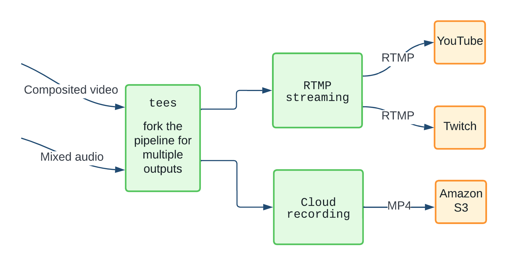
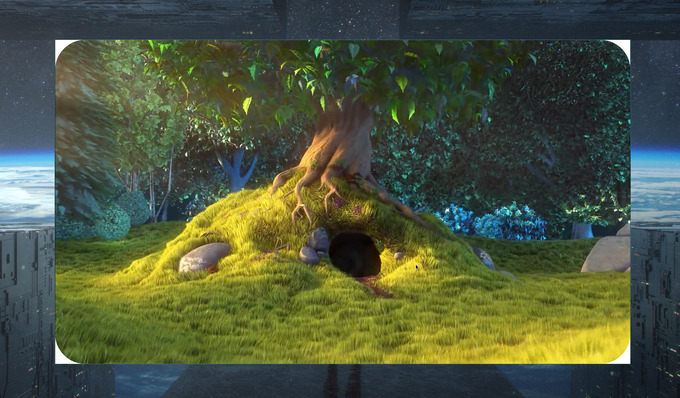
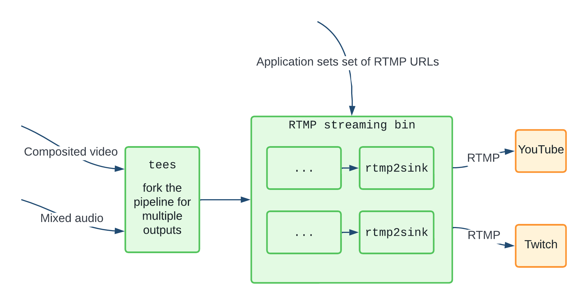

# Who?

- Who are we?
  * Open source consulting firm based out of Bangalore and Toronto
  * Work on low level systems software centred around multimedia
  * GStreamer, PipeWire, PulseAudio
  * Language Polyglots
- Who am I?
  * Consultant Software Engineer @ asymptotic
  * Embedded Systems background
  * Prefer C, Haskell and Rust
  * Rust and Haskell meetup Bangalore

# GStreamer

- Multiplatform Pipeline based multimedia framework
- Simple pipeline
  ```bash
  gst-launch-1.0 videotestsrc ! autovideosink
  gst-launch-1.0 audiotestsrc ! autoaudiosink
  ```
- Bindings for various languages
- Allows building complex media processing workflows
- Some applications
  * PiTiVi (Video Editor)
  * amaroK, Banshee, Clementine (audio players)
  * Empathy (VOIP and video conferencing)
  * GstLAL (gravitational wave data analysis)
  * Rygel (DLNA streaming server and renderer)
  * Totem (movie player for the GNOME desktop)

# Why Rust?

- Bindings/abstractions over GLib/GObject
- GStreamer bindings
- Codec implementations in pure Rust (Rust Audio, Xiph AV1, Symphonia)
- Things we care about
  * **Low cognitive overhead**
  * Immutability
  * Expressive type system
  * Memory safety and concurrency
  * Foreign Function Interface
  * Tooling (bindgen, rust-analyzer ...)


# Why immutability and types matter?

```c
      let caps: gst::Caps = gst::Caps::builder("video/x-raw")
          .field("width", crop_w)
          .field("height", crop_h)
          .field("pixel-aspect-ratio", gst::Fraction::new(1, 1))
          .build();
      let s = caps.remove_structure(0);
```

# Why immutability and types matter?

```bash
warning: unused variable: `s`
   --> video-bin/src/imp.rs:152:13
    |
152 |         let s = caps.remove_structure(0);
    |             ^ help: if this is intentional, prefix it with an
                    underscore: `_s`
    |
    = note: `#[warn(unused_variables)]` on by default
error[E0596]: cannot borrow data in dereference of `gstreamer::Caps`
              as mutable
   --> video-bin/src/imp.rs:152:17
    |
152 |         let s = caps.remove_structure(0);
    |                 ^^^^^^^^^^^^^^^^^^^^^^^^ cannot borrow as mutable
    |
    = help: trait `DerefMut` is required to modify through a dereference,
            but it is not implemented for `gstreamer::Caps`
```

# Why immutability and types matter?

```c
        let mut caps: gst::Caps = gst::Caps::builder("video/x-raw")
            .field("width", crop_w)
            .field("height", crop_h)
            .field("pixel-aspect-ratio", gst::Fraction::new(1, 1))
            .build();
        let _s = caps.remove_structure(0);
```


# Why immutability and types matter?

```bash
warning: variable does not need to be mutable
   --> video-bin/src/imp.rs:147:13
    |
147 |         let mut caps: gst::Caps = gst::Caps::builder("video/x-raw")
    |             ----^^^^
    |             |
    |             help: remove this `mut`
    |
    = note: `#[warn(unused_mut)]` on by default
error[E0596]: cannot borrow data in dereference of `gstreamer::Caps`
              as mutable
   --> video-bin/src/imp.rs:152:18
    |
152 |         let _s = caps.remove_structure(0);
    |                  ^^^^^^^^^^^^^^^^^^^^^^^^ cannot borrow as mutable
    = help: trait `DerefMut` is required to modify through a dereference,
            but it is not implemented for `gstreamer::Caps`
```

# Why immutability and types matter?

```c
        let caps: gst::Caps = gst::Caps::builder("video/x-raw")
            .field("width", crop_w)
            .field("height", crop_h)
            .field("pixel-aspect-ratio", gst::Fraction::new(1, 1))
            .build();
        let caps = caps.get_mut().unwrap();
        let _s = caps.remove_structure(0);
```

# Why immutability and types matter?

```bash
error[E0596]: cannot borrow `caps` as mutable, as it is not declared
              as mutable
   --> video-bin/src/imp.rs:152:20
    |
147 |         let caps: gst::Caps = gst::Caps::builder("video/x-raw")
    |             ---- help: consider changing this to be mutable:
                      `mut caps`
...
152 |         let caps = caps.get_mut().unwrap();
    |                    ^^^^^^^^^^^^^^ cannot borrow as mutable

For more information about this error, try `rustc --explain E0596`.
```

# Why immutability and types matter?

```c
        let mut caps: gst::Caps = gst::Caps::builder("video/x-raw")
            .field("width", crop_w)
            .field("height", crop_h)
            .field("pixel-aspect-ratio", gst::Fraction::new(1, 1))
            .build();
        if let Some(caps) = caps.get_mut() {
            let _s = caps.remove_structure(0);
        }
```

# rustc explain

```bash
This error occurs because you tried to mutably borrow a non-mutable
variable.

Erroneous code example:

```
let x = 1;
let y = &mut x; // error: cannot borrow mutably
```

In here, `x` isn't mutable, so when we try to mutably borrow it in `y`,
it fails. To fix this error, you need to make `x` mutable:

```
let mut x = 1;
let y = &mut x; // ok!
```
```

# Daily's Streaming Architecture

{width=80%}

# GStreamer pipeline

{width=80%}

# Like Lego

{width=80%}

# Custom elements

{width=60%}

```bash
gst-launch-1.0 filesrc location=bunny.mp4 ! decodebin ! videoconvert !
roundedcorners border-radius-px=100 ! videoconvert ! gtksink
```

# Managing complexity

{width=80%}


# More custom elements

{width=80%}

- Rounded corners (upstreamed)
- Overlay Composition
- Video Composition System
- Streaming
- Recording
- HTTP live streaming to AWS S3 (upstreamed)
- Migrate from rusoto to AWS SDK (upstreamed)

# Learnings

- Types and structured data
- Easier refactoring and maintenance
- Serde, an amazing framework for serializing and de-serializing Rust data structures
- Use `clone` now, worry later
- Do not use `unwrap`, if nothing else at least `expect`. `#![deny(clippy::unwrap_used)]`
- Using bindgen for consuming C/C++ dependencies
- Think about structure of code

# Resources (clickable links)

- [GStreamer for your backend services](https://asymptotic.io/blog/gstreamer-for-your-backend-services/)
- [Daily's Video Component System](https://www.daily.co/blog/new-beta-dailys-video-component-system/)
- [Why recording in WebRTC is so hard](https://www.daily.co/blog/why-recording-webrtc-is-so-hard-2/)
- [Developing a cross platform WebRTC API using Rust and WebAssembly](https://www.youtube.com/watch?v=rjbxhv_U9tw)
- [GObject subclassing in Rust ](https://www.youtube.com/watch?v=TSf3rVyv7c8)
- [GStreamer bindings for Rust](https://gitlab.freedesktop.org/gstreamer/gstreamer-rs)
- [Rust GStreamer Plugins](https://gitlab.freedesktop.org/gstreamer/gst-plugins-rs)

# Questions?

- Reach out to me on
  * Email: sanchayan@asymptotic.io, sanchayan@sanchayanmaity.net
  * Mastodon: https://functional.cafe/@sanchayan 
  * Blog: sanchayanmaity.net
- Rust Lang India
  * Rustacean Meetup: https://hasgeek.com/rustlangin
  * Twitter: @rustlangin
  * Telegram: t.me/RustIndia
